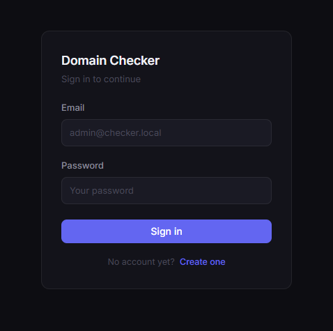
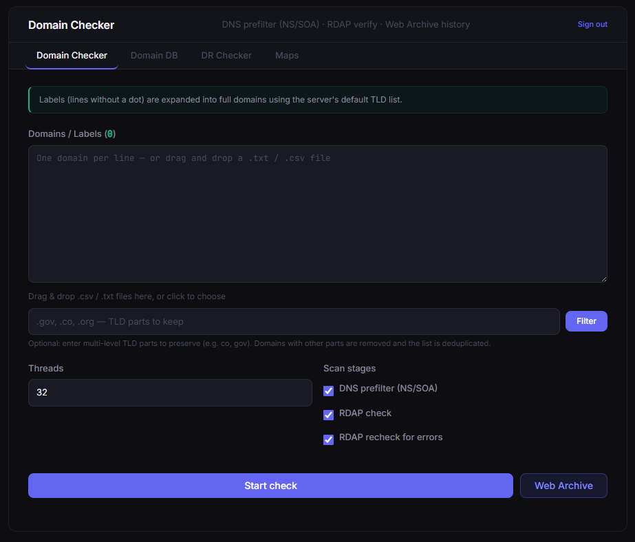
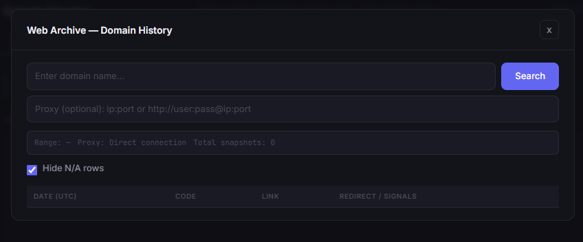
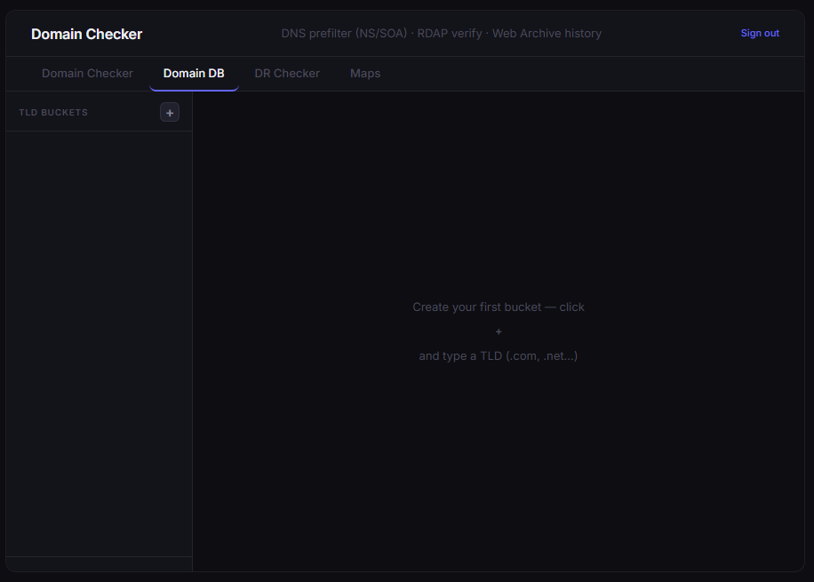
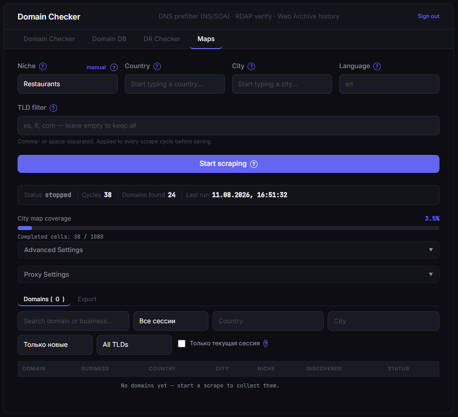

# Domain Checker

A self-hosted tool for bulk domain availability checking with DNS prefiltering,
RDAP verification, Wayback Machine history analysis, spam detection, a persistent
Domain DB, and a Google Maps lead-scraping module — all behind a lightweight
login screen.

Runs locally with `python run.py` or on a server under gunicorn — see
[Run](#run). Read [Known limitations](#known-limitations) before deploying.

**Further reading:** [docs/maps-scraper.md](docs/maps-scraper.md) — how the Maps
module is built, where its limits are, and what full autonomy would require.

## What it does

The app has three tabs plus one modal, all served from a single Flask process.
Everything except the login/register endpoints requires an authenticated session
(see [Authentication](#authentication) below).

### Domain Checker tab

Paste a list of domains or bare labels (e.g. `example` → `example.es`, `example.it`, …)
and the tool runs a two-stage pipeline:

1. **DNS prefilter** — parallel NS/SOA lookup via dnspython classifies every domain
   as `available`, `taken`, or `unknown`
2. **RDAP final check** — refines candidates through the RDAP API with automatic
   WHOIS fallback for TLDs that have no RDAP endpoint

Each stage can be toggled independently via the **Scan stages** checkboxes:
- **DNS prefilter (NS/SOA)** — uncheck to skip DNS and send all domains straight to RDAP
- **RDAP check** — uncheck to stop after DNS and use DNS results as the final output
- **RDAP recheck for errors** — also run RDAP on domains that DNS could not resolve

After a scan, available domains are automatically compared against your Domain DB —
the results panel shows which ones are **new** (not in any bucket) and which are
**already known**, with one-click options to copy or add them to a bucket.

### Web Archive modal

Fetches full Wayback Machine history for any domain on demand (open it from the
**Web Archive** button on the Domain Checker tab):

- Spam content detection — casino, pharma, adult, doorway, and parked-page patterns
- Topic shift detection across snapshots using n-gram Jaccard similarity
- Language shift detection across snapshots
- Cloaking detection — compares bot UA vs. normal UA responses (disabled by default)
- Optional Groq LLM semantic classification per snapshot (set `GROQ_API_KEY` to enable)
- Reputation checks — Google Safe Browsing, PhishTank, URLhaus host feed
- Domain age (RDAP) and TLS certificate age

### Domain DB tab

A persistent local database (stored in the browser's `localStorage`, not on the
server) for managing known domains:

- Organize domains into **TLD buckets** (`.com`, `.net`, `.ru`, …)
- Buckets are created automatically when adding domains from scan results
- Import via **drag & drop** (`.txt` / `.csv`) or paste — raw URLs, `www.` prefixes,
  and paths are automatically normalized
- **Search** within a bucket, **paginate** large lists (50 items at a time)
- **Export** any bucket as `.txt`
- Post-scan comparison highlights new domains not yet in any bucket

Because this data lives in the browser, it is **per-browser, not per-account** —
it does not sync between machines and is not affected by who is logged in.

### Maps Scraper tab

Continuously scrapes Google Maps for businesses in a given niche/city and collects
their **website domains** — useful for building outreach or prospecting lists.
It drives [gosom/google-maps-scraper](https://github.com/gosom/google-maps-scraper)
running in Docker; **see [Docker Compose setup](#docker-compose-setup) below
before using this tab** — without the container running, starting a job returns
a clear `503` error.

**Starting a job:**

1. **Niche** — pick one of 20 predefined categories, or click **manual** to type a
   free-text niche/query
2. **Country** — populated from a bundled dataset of 223 countries (no hardcoded list)
3. **City** — populated from that country's city list once you pick a country
4. **Language** — auto-filled from the country (via the `countryinfo` package) as the
   two-letter code Google Maps expects; editable if the guess is wrong
5. **TLD filter** — optional comma/space-separated list (e.g. `es, it`); only
   discovered domains ending in one of these TLDs are kept. Leave empty to keep all.
6. Click **Start scraping**

Behind the scenes: the app resolves the city's bounding box via the Nominatim API
(cached in the local database so the same city is never looked up twice), builds a
query like `"dentists in Madrid"`, and submits it to the scraper container. A
background thread polls the job every `GMAPS_POLL_INTERVAL` seconds (default 30s);
when it completes, the resulting CSV is parsed, domains are normalized (stripped of
protocol/`www.`/path) and filtered by TLD, and new ones are saved. **The cycle then
repeats automatically** — a new scrape is queued immediately — until you click **Stop**.

**Status bar** (visible while a job is active): current status, cycle count, total
domains found so far, and the timestamp of the last cycle.

**Advanced Settings** (collapsible): `depth` (how far to scroll the results list),
`zoom` (Google Maps zoom level), `grid cell, km` (how finely the city is split into
scrape cycles — see the caveat below for how this actually reaches the scraper),
and a `custom_query` override that replaces the generated `"{niche} in {city}"`
query entirely. Hover any field for a tooltip.

**Proxy Settings** (collapsible): paste one proxy per line (`ip:port`,
`ip:port:user:pass`, or `http://user:pass@ip:port`), click **Add**, then
**Check All** to test each one with a live `GET` request. Only proxies marked
**working** are sent to the scraper on the next job.

**Results**: a paginated, searchable table (Domain / Business / Country / City /
Niche / Discovered) with a TLD filter dropdown, and **Export TXT** / **Export CSV**
buttons that respect the current search/TLD filter.

**Per-account isolation**: every job, discovered domain, and proxy is scoped to the
logged-in account — two users of the same instance never see each other's Maps data
(unlike the Domain Checker and Domain DB tabs above, which are shared across the
whole running process).

> **Known limitation**: the gmaps-scraper web API (as of this writing) only accepts
> `keywords, lang, zoom, lat, lon, radius, depth, max_time, proxies` in its job
> payload — the literal `grid_bbox`/`grid_cell`/`concurrency` JSON fields are
> CLI-only flags that the HTTP API silently ignores if sent directly.
>
> `grid_cell` still works, just indirectly: this app splits the city's bounding box
> into `grid_cell`-sized cells itself, runs one cell per scrape cycle, and derives
> that cycle's `lat`/`lon`/`radius` from the cell — fields the API *does* honor. A
> bigger `grid_cell` means a wider (less precise) search radius per cycle but fewer
> cycles to cover the whole city. `concurrency` has no such path — the request
> literally carries no field the API reads for it, so it is inert today; it is
> still sent and stored per-job in case a future scraper version picks it up.

### Authentication

The whole app sits behind a session-based login (Flask session + `werkzeug.security`
password hashing). Only `/api/auth/*` and static assets are reachable without being
logged in — every other page and API route redirects to the login form / 401s.

- On first run, an account is seeded from `SEED_ADMIN_EMAIL` /
  `SEED_ADMIN_PASSWORD`. **`SEED_ADMIN_PASSWORD` has no default** — with an empty
  users table and no password set, the app refuses to start rather than create a
  known account. The email is logged, the password is not.
- New accounts can self-register from the login screen ("Create one").
- Registering a second account does **not** give it access to the first account's
  Maps jobs/domains/proxies (isolated per `owner_id`) — but it *does* share the same
  Domain Checker/Domain DB state, since those aren't account-scoped.

## Screenshots

| | |
|---|---|
|  |  |
| **Sign in** | **Domain Checker** |
|  |  |
| **Web Archive** | **Domain DB** |
|  | |
| **Maps Scraper** | |

## Tech stack

| Layer                | Technology                                          |
| --------------------- | --------------------------------------------------- |
| Backend               | Python 3.10+, Flask 3.1.3                            |
| WSGI server           | gunicorn (single worker — see [Run](#run))          |
| Auth                  | Flask session, werkzeug.security (password hashing) |
| Storage               | SQLite (Maps + users), browser `localStorage` (Domain DB) |
| DNS resolution        | dnspython 2.8.0                                      |
| HTTP / RDAP / WHOIS   | requests 2.34.2, socket                              |
| Concurrency           | threading, ThreadPoolExecutor                        |
| Archive               | Wayback Machine CDX API, optional Groq LLM classifier |
| Maps scraping         | [gosom/google-maps-scraper](https://github.com/gosom/google-maps-scraper) (Docker), Nominatim, `countryinfo` |
| Geo dataset           | [dr5hn/countries-states-cities-database](https://github.com/dr5hn/countries-states-cities-database) (bundled, trimmed) |
| Frontend              | Vanilla JS, CSS (no frameworks)                      |

## Requirements

- Python 3.10 or newer
- Windows / macOS / Linux
- **Docker + Docker Compose** — only needed for the Maps Scraper tab; every other
  tab works without it

## Setup

```bash
cd backend
pip install -r requirements.txt   # or requirements-dev.txt to also get pytest
cp .env.example .env
```

Then set `SECRET_KEY` in `backend/.env` — the app will not start without it:

```bash
python -c "import secrets; print(secrets.token_hex(32))"
```

**Windows shortcut:** double-click `backend/run.bat` — it installs dependencies
and starts the server in one step.

## Run

Local development — Flask's dev server:

```bash
cd backend
python run.py
```

Server — gunicorn via the WSGI entry point:

```bash
gunicorn -w 1 --threads 8 --timeout 600 -b 0.0.0.0:8080 wsgi:app
```

Or the whole stack (app + scraper) in Docker:

```bash
docker compose up -d --build
```

Open `http://127.0.0.1:8080` and log in (see [Authentication](#authentication)).

> **Run a single worker.** Scan progress lives in `app.checker_state` and the
> Maps job pollers are daemon threads — both are per-process. With `-w 2` a
> request to `/api/status` may land on a worker that knows nothing about the scan
> another worker is running, so progress appears to jump or reset. Scale with
> `--threads`, not `-w`, until that state moves out of process memory.

## Tests

```bash
cd backend
pip install -r requirements-dev.txt
python -m playwright install chromium   # once, for the browser tests
python -m pytest -q
```

43 tests, no outbound network calls — everything external is mocked and the
database is a temporary SQLite file.

| | |
|---|---|
| `tests/test_app.py` | 35 API tests: scan pipeline, auth, Maps API |
| `tests/test_e2e.py` | 8 browser tests driving the real UI with Playwright |

The browser tests cover what a static check cannot: that `data-action` buttons
reach their module, that delegated handlers survive a re-render, and that the
checker tab still calls into the Domain DB module after a scan. They run the app
in-process, so they can patch `dns_check` and `requests.get`.

Skip them when you have no browser installed:

```bash
python -m pytest -q -m "not e2e"
```

## Docker Compose setup

`docker-compose.yml` in the project root defines two services:

| Service | What |
|---|---|
| `checker` | This app, built from `backend/Dockerfile`, gunicorn on `:8080` |
| `gmaps-scraper` | [gosom/google-maps-scraper](https://github.com/gosom/google-maps-scraper) in web/API mode, on `:8090` |

`checker` reads the same `backend/.env` as a local run (`env_file`), overriding only
what differs inside the network — notably `GMAPS_API_URL=http://gmaps-scraper:8080`,
the scraper's *internal* port rather than the published 8090. The SQLite file lives
in the `checker-data` volume, so it survives rebuilds.

> **Both ports are bound to `127.0.0.1`.** Docker's port publishing writes its own
> iptables rules and bypasses `ufw`, so a `0.0.0.0` mapping would be reachable from
> the internet no matter what the firewall says — and the scraper API has no
> authentication at all. Serve the app publicly through a reverse proxy on 80/443,
> not by widening these mappings.

> **The scraper runs with `-c 1`.** Its default concurrency is "half of CPU cores",
> which integer-divides to `0` on a single-core host — it then panics with
> `Concurrency must be greater than 0` and restarts forever, and the Maps tab
> reports it as unreachable because Docker drops restarting containers from its
> internal DNS. Raise the number on a bigger host.

**Start it** (from the project root, where `docker-compose.yml` lives):

```bash
docker compose up -d --build
```

The first run pulls the scraper image (Playwright + Chromium inside, so it's a few
hundred MB — be patient). **Verify both are up:**

```bash
docker compose ps
```

Running the app locally instead (`python run.py`) while only the scraper is in
Docker also works — then `GMAPS_API_URL` stays `http://localhost:8090`, which is
the default.

**If the container isn't running**, clicking **Start scraping** in the Maps tab
returns a `503` with a message like *"Google Maps scraper is unreachable at
http://localhost:8090/..."*, shown directly in the tab — nothing else in the app is
affected.

**Stop it** (data/cache volumes are preserved):

```bash
docker compose down
```

**Reset it completely** (also wipes the scraper's own cache/results, not this app's
`maps.db` — that's separate):

```bash
docker compose down -v
```

## Usage pipeline — quick reference

A short "what do I click" summary per tab, for when you just want to get moving:

1. **First login** — open the app, sign in with the seeded admin account (or
   register a new one), change the seed password from a real client if you plan to
   expose this beyond localhost.
2. **Domain Checker** — paste domains/labels → adjust threads/scan stages if needed
   → **Start check** → watch the progress bar → download results or compare against
   the Domain DB when it finishes.
3. **Web Archive** — click **Web Archive** from the Domain Checker tab → type a
   domain (optionally a proxy) → **Search** → scroll the snapshot table.
4. **Domain DB** — switch tabs → click **+** to create a TLD bucket → paste or
   drag-and-drop domains into it → search/export as needed.
5. **Maps Scraper** — make sure the Docker container is up (see above) → pick
   niche/country/city → optionally open **Advanced Settings** / **Proxy Settings**
   → **Start scraping** → watch the status bar tick over on each cycle → browse or
   export the **Domains** results table → **Stop** when you have enough.

## Project structure

```
backend/
├── app/
│   ├── archive/
│   │   ├── fetcher.py          # CDX API, pagination, redirect probing, proxy support
│   │   ├── spam_detector.py    # Content spam analysis, topic/language shift, cloaking
│   │   ├── groq_classifier.py  # Optional Groq LLM semantic classifier for snapshots
│   │   └── reputation.py       # Safe Browsing, PhishTank, URLhaus, risk scoring
│   ├── services/
│   │   ├── dns_checker.py      # DNS prefilter — NS/SOA via dnspython (1.1.1.1, 8.8.8.8)
│   │   ├── rdap_service.py     # RDAP final check with per-TLD concurrency and WHOIS fallback
│   │   ├── domain_processor.py # Label → domain expansion and deduplication
│   │   ├── geo_data.py         # Bundled countries/cities, Nominatim bbox (+cache), country language
│   │   ├── gmaps_client.py     # HTTP client for gosom/google-maps-scraper + job payload builder
│   │   ├── maps_service.py     # Poll-loop daemon thread, CSV ingest, infinite re-scrape cycle
│   │   └── proxy_service.py    # Proxy storage + background "Check All" worker
│   ├── data/
│   │   ├── geo.json            # Trimmed dr5hn dataset: country name/code + city name/lat/lng
│   │   └── niches.json         # 20 predefined Maps niches
│   ├── utils/
│   │   ├── validators.py       # normalize_domain, to_ascii, is_valid_domain
│   │   ├── helpers.py          # dedupe, parse_tlds, split_list, now_iso, escape_like
│   │   ├── proxy.py            # Proxy URL parsing/masking, shared by Archive and Maps
│   │   └── settings.py         # apply_config — injects settings into worker-thread modules
│   ├── models.py               # Thread-safe Domain Checker scan state
│   ├── check_pipeline.py       # Two-stage DNS + RDAP checking pipeline
│   ├── db.py                   # SQLite connection helper + schema/migrations (Maps + users)
│   ├── auth.py                 # Session auth, login_required gate, seed admin account
│   ├── logging_setup.py        # Root logger configuration (LOG_LEVEL)
│   ├── routes.py               # Domain Checker and Web Archive endpoints
│   └── maps_routes.py          # /api/maps/* endpoints
├── static/
│   ├── css/style.css           # All styles (CSS custom properties + component system)
│   └── js/                     # ES modules — see "Frontend" below
├── templates/
│   ├── index.html              # Single-page app shell (all tabs)
│   └── login.html              # Login / register screen
├── tests/
│   ├── test_app.py             # API tests
│   └── test_e2e.py             # Browser tests (Playwright, marked `e2e`)
├── config.py                   # All settings via environment variables
├── wsgi.py                     # WSGI entry point (gunicorn) — production
├── run.py                      # Flask dev server — local development
├── run.bat                     # Windows one-click launcher
├── Dockerfile                  # Application image
├── pytest.ini
├── requirements.txt
└── requirements-dev.txt        # requirements.txt + pytest + pytest-playwright

docker-compose.yml              # App + gosom/google-maps-scraper (project root)
docs/
├── maps-scraper.md             # Maps module: architecture, limits, path to autonomy
└── screenshots/
```

### Frontend

`static/js` is plain ES modules — no build step, no framework. `index.html` loads
`main.js` with `type="module"` and the browser resolves the rest.

| Module | Owns |
|---|---|
| `main.js` | Tab navigation and **every** DOM binding |
| `shared.js` | `escapeHtml`, `showToast` |
| `checker.js` | Scan run, domain textarea, file import |
| `archive.js` | Web Archive modal |
| `domain-db.js` | `localStorage` TLD buckets |
| `maps.js` | Maps job lifecycle, results, proxy pool |
| `auth.js` | Sign out |

Feature modules export behaviour and never attach listeners to markup they do not
own, so all wiring lives in `main.js`. Buttons declare `data-action` (plus
`data-arg` when the call takes a literal) and go through one delegated click
handler, which keeps working for rows rendered after load.

**When adding a button:** give it `data-action="yourFunction"`, export
`yourFunction` from its module, and add it to the `ACTIONS` map in `main.js`.
An unknown `data-action` logs a console warning rather than failing silently.

Changes here are covered by the browser tests — see [Tests](#tests).

## API reference

### `GET /`
Serves the single-page app (`index.html`) if authenticated, otherwise the login form.

---

### Domain Checker

#### `GET /api/status`
Returns current scan state.

**Response:**
```json
{
  "status": "idle | running | done | error",
  "total": 0,
  "processed": 0,
  "available": 0,
  "taken": 0,
  "invalid": 0,
  "errors": 0,
  "current_domain": ""
}
```

---

#### `POST /api/check`
Start a domain availability scan.

**Request body:**
```json
{
  "domains": "example\ntest.com",
  "threads": 32,
  "tlds": "es it pl",
  "dns_enabled": true,
  "rdap_enabled": true,
  "rdap_recheck_errors": false
}
```

| Field | Type | Default | Description |
|---|---|---|---|
| `domains` | string | required | Newline-separated domains or bare labels |
| `threads` | int | `32` | DNS prefilter thread count (1–128) |
| `tlds` | string | _(server default)_ | TLDs for label expansion; uses `DEFAULT_TLDS` if empty |
| `dns_enabled` | bool | `true` | Run the DNS prefilter stage; if false, all domains go directly to RDAP |
| `rdap_enabled` | bool | `true` | Run the RDAP final check; if false, DNS results are the final output |
| `rdap_recheck_errors` | bool | `false` | Run RDAP on DNS-error domains too |

**Response (200):**
```json
{
  "status": "started",
  "expanded_total": 480,
  "filtered_total": 480,
  "tlds": ["es", "it"],
  "final_check_enabled": true,
  "final_check_workers": 12,
  "rdap_recheck_errors": false,
  "rdap_bootstrap_url": "https://data.iana.org/rdap/dns.json"
}
```

**Error (409):** scan already in progress.

---

#### `POST /api/stop`
Request the active scan to stop.

**Response (200):** `{"status": "stopping"}`
**Error (409):** no active scan.

---

#### `GET /api/download/<result_type>`
Download one result category as a `.txt` file. `result_type`: `available`, `taken`,
`invalid`, or `errors`.

---

#### `GET /api/download-all`
Download all four result categories as `checker-results.zip`.

---

### Web Archive

#### `POST /api/archive`
Fetch and analyze Wayback Machine history for a domain.

**Request body:**
```json
{
  "domain": "example.com",
  "proxy": "http://user:pass@ip:port"
}
```

| Field | Type | Description |
|---|---|---|
| `domain` | string | Domain to look up |
| `proxy` | string | Optional proxy (`ip:port` or `http://user:pass@ip:port`) |

**Response (200):**
```json
{
  "results": [
    {
      "date": "2018-03-14 12:00:00",
      "status": "200",
      "link": "https://web.archive.org/web/20180314120000/http://example.com/",
      "redirect": "",
      "spam": ["casino"],
      "topic_shift": false,
      "language_shift": false,
      "cloaking": false,
      "groq_topic": "",
      "groq_reason": ""
    }
  ],
  "total_results": 1,
  "range": {"from": 1998, "to": 2026},
  "proxy": {"enabled": false, "mode": "direct", "current": "Direct connection"},
  "used_connection": "direct",
  "cdx_endpoint": "https://web.archive.org/cdx/search/cdx",
  "spam_checked": 45,
  "spam_flagged": 3,
  "reputation": {},
  "risk": {},
  "fetch_error": "",
  "truncated": false
}
```

---

---

### Auth

#### `POST /api/auth/register`
**Request body:** `{"email": "...", "password": "..."}` (password ≥ 6 chars)
**Response (201):** `{"id": 2, "email": "..."}`
**Errors:** `400` invalid email/short password, `409` email already registered.

#### `POST /api/auth/login`
**Request body:** `{"email": "...", "password": "..."}`
**Response (200):** `{"id": 1, "email": "..."}`, sets the session cookie.
**Error (401):** invalid email or password.

#### `POST /api/auth/logout`
**Response (200):** `{"ok": true}`, clears the session.

#### `GET /api/auth/me`
**Response (200):** `{"id": 1, "email": "...", "created_at": "..."}`
**Error (401):** not authenticated.

---

### Maps Scraper

All `/api/maps/*` routes require authentication and are scoped to the logged-in
account (`owner_id`).

#### `GET /api/maps/geo`
Returns the bundled country/city dataset with each country's resolved language.

**Response (200):** `[{"name": "Spain", "code": "ES", "language": "es", "cities": [{"name": "Madrid", "lat": 40.4165, "lng": -3.70256}, ...]}, ...]`

#### `GET /api/maps/niches`
**Response (200):** `[{"value": "restaurants", "label": "Restaurants"}, ...]` (20 entries)

#### `GET /api/maps/sessions`
Lists past/current jobs for the account with a per-job domain count — used to
filter results down to what one specific run found.

#### `POST /api/maps/job/start`
**Request body:**
```json
{
  "niche": "dentists",
  "country": "Spain",
  "city": "Madrid",
  "language": "es",
  "tld_filter": "es",
  "depth": 10,
  "concurrency": 4,
  "grid_cell": 1.0,
  "zoom": 15,
  "custom_query": ""
}
```
`niche`+`city`+`country` are required unless `custom_query` is set. Resolves the
city's bounding box (Nominatim, cached), submits the job to gmaps, and starts the
poll-loop thread.

**Response (201):** the created job row.
**Errors:** `400` missing niche/city/country, `409` a job is already running for
this account, `503` gmaps container unreachable.

#### `POST /api/maps/job/stop`
**Request body:** `{"job_id": 12}` (optional — defaults to the account's active job)
**Response (200):** the updated job row.
**Errors:** `409` no active job, `503` gmaps unreachable while deleting the remote job.

#### `GET /api/maps/job/status`
**Response (200):** `{"job": {...} | null, "domains": 8, "total_domains": 42, "coverage": {...} | null}`

#### `GET /api/maps/domains`
**Query params:** `page`, `limit` (default 50, max 500), `country`, `city`, `tld`,
`search`, `session` (job id), `active` (`1` = only the currently running job's
finds), `export_status` (`all` | `new` | `exported`).

**Response (200):** `{"items": [...], "page": 1, "limit": 50, "total": 8, "pages": 1, "tlds": ["es", "it"]}`

#### `GET /api/maps/domains/export`
**Query params:** `format` (`txt` | `csv`), plus the same filters as `/domains`.
Marks the exported rows' `exported_at` timestamp. CSV is semicolon-separated with a
UTF-8 BOM: `domain;business;country;city;niche;discovered`.

#### `GET /api/maps/proxies`
**Query params:** `page`, `limit` (max 100), `search`.
**Response (200):** `{"items": [...], "total": 4, "page": 1, "limit": 10, "pages": 1, "checking": false}`

#### `POST /api/maps/proxies`
**Request body:** `{"proxies": "1.2.3.4:8080\n5.6.7.8:3128"}` (newline/comma-separated, or a JSON array)
**Response (201):** `{"added": 2, "items": [...], "total": 2}`

#### `POST /api/maps/proxies/check`
Kicks off a background check of every stored proxy (`GET` against `PROXY_CHECK_URL`).
**Response (200):** `{"status": "checking"}`
**Error (409):** a check is already running.

#### `DELETE /api/maps/proxies/<id>`
**Response (200):** `{"ok": true}` / **Error (404)** proxy not found.

#### `DELETE /api/maps/proxies/failed`
Deletes every proxy currently marked `failed`.
**Response (200):** `{"ok": true, "deleted": 3}`

---

## Configuration

Copy `.env.example` to `backend/.env` and adjust as needed. Everything is optional
**except `SECRET_KEY`** — the app refuses to start without it.

### Server / Auth

| Variable | Default | Description |
|---|---|---|
| `SECRET_KEY` | — | **Required.** Signs the auth session cookie. Generate with `python -c "import secrets; print(secrets.token_hex(32))"` |
| `HOST` | `0.0.0.0` | Bind address |
| `PORT` | `8080` | HTTP port |
| `DEBUG` | `False` | Enable Flask debug mode |
| `LOG_LEVEL` | `INFO` | `DEBUG` / `INFO` / `WARNING` / `ERROR` — logs go to stdout |
| `SESSION_COOKIE_SECURE` | `0` | Set to `1` when serving over HTTPS |
| `CORS_ORIGINS` | _(empty)_ | Comma-separated allowed CORS origins; empty = disabled |
| `MAX_DOMAINS` | `200000` | Max domains accepted per scan request |
| `SEED_ADMIN_EMAIL` | `admin@checker.local` | Account created on first run if no users exist |
| `SEED_ADMIN_PASSWORD` | — | **Required on first run.** Password for the seeded account; the app will not start without it while no users exist |
| `MAPS_DB_PATH` | _(empty → `backend/data/maps.db`)_ | SQLite file for Maps tables + `users` |

### Scan / RDAP

| Variable | Default | Description |
|---|---|---|
| `DEFAULT_TLDS` | `es it pl fr de pt nl be se fi no dk tr in ca br mx co` | TLDs appended to bare labels |
| `DNS_PREFILTER_STRICT_TLDS` | `com in co mx vn` | TLDs where DNS result is trusted without RDAP |
| `DNS_RESOLVERS` | `1.1.1.1 8.8.8.8` | Nameservers used by the DNS prefilter |
| `DNS_TIMEOUT` | `1.6` | Per-query DNS timeout (seconds) |
| `DNS_RETRIES` | `2` | DNS retry count on timeout |
| `FINAL_CHECK_ENABLED` | `1` | Enable RDAP second-pass check |
| `FINAL_CHECK_WORKERS` | `20` | RDAP parallel workers |
| `RDAP_BOOTSTRAP_URL` | `https://data.iana.org/rdap/dns.json` | IANA RDAP endpoint registry |
| `RDAP_TIMEOUT` | `7.0` | Per-request RDAP timeout (seconds) |
| `RDAP_RETRIES` | `2` | RDAP retry count on transient failure |
| `RDAP_BACKOFF_BASE` | `0.6` | Retry back-off base (seconds) |
| `RDAP_BACKOFF_JITTER` | `0.25` | Retry back-off jitter (seconds) |
| `RDAP_CONCURRENCY_DEFAULT` | `12` | Default RDAP concurrency |
| `RDAP_CONCURRENCY_ES` | `2` | RDAP concurrency cap for `.es` |
| `RDAP_CONCURRENCY_IT` | `4` | RDAP concurrency cap for `.it` |
| `RDAP_TLD_OVERRIDES` | _(empty)_ | JSON map of TLD → RDAP endpoint |
| `RDAP_CONCURRENCY_OVERRIDES` | _(empty)_ | JSON map of TLD → concurrency limit |
| `RDAP_SESSION_POOL_CONNECTIONS` | `32` | HTTP connection pool size |
| `RDAP_SESSION_POOL_MAXSIZE` | `64` | HTTP connection pool max size |
| `RDAP_FORBIDDEN_FALLBACK` | `1` | Fall back to WHOIS on HTTP 403 |
| `RDAP_PARSE_ERROR_BODY` | `1` | Try to parse RDAP error response bodies |
| `RDAP_RESTRICTED_ENABLE` | `1` | Track restricted/rate-limited TLDs |
| `RDAP_RESTRICTED_TTL` | `600` | Restricted TLD cache lifetime (seconds) |
| `WHOIS_SERVER_OVERRIDES` | _(empty)_ | JSON map of TLD → WHOIS server |
| `WHOIS_NOT_FOUND_OVERRIDES` | _(empty)_ | JSON map of TLD → "not found" response text |
| `WHOIS_BOOTSTRAP_ENABLED` | `1` | Use IANA WHOIS bootstrap |
| `WHOIS_BOOTSTRAP_SERVER` | `whois.iana.org` | IANA bootstrap WHOIS server |

### Archive / Wayback

| Variable | Default | Description |
|---|---|---|
| `ARCHIVE_USER_AGENT` | `Mozilla/5.0 (Windows NT 10.0; Win64; x64) AppleWebKit/537.36` | User-Agent sent to Wayback |
| `ARCHIVE_YEAR_FROM` | `1998` | Earliest snapshot year to fetch |
| `ARCHIVE_YEAR_TO` | `2026` | Latest snapshot year to fetch |
| `ARCHIVE_TIMEOUT` | `45` | CDX request timeout (seconds) |
| `ARCHIVE_REQUEST_RETRIES` | `3` | CDX retry count |
| `ARCHIVE_MAX_SECONDS` | `60` | Hard time budget for the full CDX fetch |
| `ARCHIVE_PROXY_TIMEOUT` | `10` | Timeout when fetching via proxy (seconds) |
| `ARCHIVE_PROXY_REQUEST_RETRIES` | `1` | Retry count for proxied CDX requests |
| `ARCHIVE_DIRECT_FALLBACK` | `1` | Fall back to direct connection when proxy yields no rows |
| `ARCHIVE_VERIFY_EMPTY_WITH_FALLBACK` | `1` | Re-verify empty proxy result via direct connection |
| `ARCHIVE_CDX_ALLOW_HTTP_FALLBACK` | `1` | Try HTTP CDX endpoint if HTTPS fails |
| `ARCHIVE_CDX_PAGE_SIZE` | `2000` | Rows per CDX page |
| `ARCHIVE_CDX_MAX_PAGES` | `400` | Maximum CDX pages to fetch |
| `ARCHIVE_CDX_MAX_ROWS` | `600000` | Absolute row cap across all pages |
| `ARCHIVE_REDIRECT_FETCH_ENABLED` | `1` | Probe 301/302 redirect destinations |
| `ARCHIVE_REDIRECT_FETCH_MAX` | `180` | Max redirects to probe |
| `ARCHIVE_REDIRECT_FETCH_WORKERS` | `8` | Parallel redirect probe workers |
| `ARCHIVE_REDIRECT_FETCH_TIMEOUT` | `6` | Per-redirect probe timeout (seconds) |
| `ARCHIVE_REDIRECT_FALLBACK_ON_MISSING_COLUMNS` | `1` | Retry via direct if proxy response lacks redirect columns |

### Spam detection

| Variable | Default | Description |
|---|---|---|
| `ARCHIVE_SPAM_CHECK_ENABLED` | `1` | Enable spam content analysis |
| `ARCHIVE_SPAM_CHECK_MAX` | `120` | Max snapshots to inspect per domain |
| `ARCHIVE_SPAM_CHECK_WORKERS` | `6` | Parallel spam-check workers |
| `ARCHIVE_SPAM_CHECK_TIMEOUT` | `6` | Per-snapshot fetch timeout (seconds) |
| `ARCHIVE_SPAM_CHECK_MAX_BYTES` | `250000` | Max response body size to analyze |
| `ARCHIVE_SPAM_PROPAGATE_THRESHOLD` | `0.7` | Fraction of checked snapshots that must share a label to propagate it to all |
| `ARCHIVE_TOPIC_CHANGE_ENABLED` | `1` | Enable topic shift detection |
| `ARCHIVE_TOPIC_CHANGE_THRESHOLD` | `0.18` | Jaccard dissimilarity threshold for a topic shift |
| `ARCHIVE_TOPIC_CHANGE_ONLY_IF_SPAM` | `1` | Only flag topic shifts on snapshots already flagged as spam |
| `ARCHIVE_TOPIC_CHANGE_MIN_CHARS` | `320` | Min snapshot text length to include in topic analysis |
| `ARCHIVE_TOPIC_NGRAM_SIZE` | `4` | N-gram size for topic fingerprinting |
| `ARCHIVE_TOPIC_MAX_NGRAMS` | `500` | Max n-grams retained per snapshot signature |
| `ARCHIVE_LANG_SHIFT_ENABLED` | `1` | Enable language shift detection |
| `ARCHIVE_LANG_SHIFT_MIN_CHARS` | `280` | Min snapshot text length for language detection |
| `ARCHIVE_CJK_DENSITY_THRESHOLD` | `0.25` | CJK character density threshold for the ideographs label |
| `ARCHIVE_CHINESE_DENSITY_THRESHOLD` | `0.15` | Density threshold for the Chinese-spam label |
| `ARCHIVE_CJK_MIN_CHARS` | `10` | Min chars before CJK density is evaluated |
| `ARCHIVE_CLOAK_CHECK_ENABLED` | `0` | Enable cloaking detection (makes live HTTP requests) |
| `ARCHIVE_CLOAK_CHECK_MAX` | `40` | Max snapshots to probe for cloaking |
| `ARCHIVE_CLOAK_CHECK_TIMEOUT` | `6` | Per-snapshot cloaking probe timeout (seconds) |
| `ARCHIVE_CLOAK_CHECK_MAX_BYTES` | `200000` | Max response size for cloaking probe |
| `ARCHIVE_CLOAK_CHECK_THRESHOLD` | `0.18` | Jaccard dissimilarity threshold for cloaking detection |
| `ARCHIVE_CLOAK_CHECK_MIN_CHARS` | `280` | Min chars for a snapshot to be considered in cloaking check |
| `ARCHIVE_CLOAK_CHECK_UA` | Googlebot UA | User-agent string for the bot-simulation probe |
| `ARCHIVE_REPUTATION_CHECK_ENABLED` | `1` | Enable reputation checks (Safe Browsing, PhishTank, URLhaus) |
| `ARCHIVE_REPUTATION_TIMEOUT` | `6` | Reputation API request timeout (seconds) |
| `ARCHIVE_REPUTATION_SAFE_BROWSING_KEY` | _(empty)_ | Google Safe Browsing API key |
| `ARCHIVE_REPUTATION_SAFE_BROWSING_CLIENT_ID` | `checker` | Safe Browsing client ID |
| `ARCHIVE_REPUTATION_SAFE_BROWSING_CLIENT_VERSION` | `1.0` | Safe Browsing client version |
| `ARCHIVE_REPUTATION_PHISHTANK_KEY` | _(empty)_ | PhishTank API key (optional) |
| `ARCHIVE_REPUTATION_BLOCKLIST_PATHS` | _(empty)_ | Colon-separated paths to local plaintext blocklist files |
| `ARCHIVE_REPUTATION_URLHAUS_HOSTFILE_URL` | _(empty)_ | URLhaus host-feed URL |
| `ARCHIVE_REPUTATION_URLHAUS_TTL` | `3600` | URLhaus feed cache lifetime (seconds) |
| `ARCHIVE_RDAP_CHECK_ENABLED` | `1` | Look up domain age via RDAP in the archive view |
| `ARCHIVE_RDAP_TIMEOUT` | `6` | RDAP timeout for archive age lookup (seconds) |
| `ARCHIVE_RDAP_ENDPOINT` | `https://rdap.org/domain/` | RDAP endpoint used for archive age lookup |
| `ARCHIVE_TLS_CHECK_ENABLED` | `1` | Probe TLS certificate to determine cert age |
| `ARCHIVE_TLS_TIMEOUT` | `4` | TLS probe timeout (seconds) |
| `ARCHIVE_NOT_SUITABLE_SCORE` | `50` | Risk score threshold for a "not suitable" verdict |

### Groq LLM classifier (optional)

| Variable | Default | Description |
|---|---|---|
| `GROQ_API_KEY` | _(empty)_ | Leave blank to disable Groq classification entirely |
| `GROQ_MODEL` | `llama-3.1-8b-instant` | Groq model used for snapshot classification |
| `GROQ_TIMEOUT` | `8` | Per-request timeout (seconds) |
| `GROQ_SNAPSHOT_MAX` | `60` | Snapshots analyzed per domain, evenly spread across the time range (25 RPM free tier: 60 ≈ 2.5 min, 100 ≈ 4 min) |

### Maps Scraper (Docker)

| Variable | Default | Description |
|---|---|---|
| `GMAPS_API_URL` | `http://localhost:8090` | Base URL of the gmaps-scraper REST API — must match the port mapping in `docker-compose.yml` |
| `GMAPS_TIMEOUT` | `20` | Timeout for job create/status/delete requests (seconds) |
| `GMAPS_DOWNLOAD_TIMEOUT` | `120` | Timeout for downloading the results CSV (seconds) |
| `GMAPS_POLL_INTERVAL` | `30` | How often the poll-loop thread checks job status (seconds) |
| `GMAPS_MAX_TIME` | `600` | `max_time` sent to gmaps per scrape cycle (seconds) — gmaps requires this to be non-zero |
| `GMAPS_DEFAULT_DEPTH` | `10` | Default scroll depth |
| `GMAPS_DEFAULT_ZOOM` | `15` | Default Google Maps zoom level |
| `GMAPS_DEFAULT_CONCURRENCY` | `4` | Default concurrency (stored per-job; not read by the gmaps web API today) |
| `GMAPS_DEFAULT_GRID_CELL` | `1.0` | Default city coverage cell size in km — overridable per job from the Maps tab's Advanced Settings. Splits the city bbox into cells; each scrape cycle covers one, so this sets the `radius` sent to the gmaps API (see below) |

### Geo / Nominatim

| Variable | Default | Description |
|---|---|---|
| `NOMINATIM_URL` | `https://nominatim.openstreetmap.org/search` | Endpoint used to resolve a city's bounding box |
| `NOMINATIM_USER_AGENT` | `DomainChecker/1.0` | Sent per [Nominatim's usage policy](https://operations.osmfoundation.org/policies/nominatim/) — required |
| `NOMINATIM_TIMEOUT` | `15` | Request timeout (seconds) |

### Proxy checking

| Variable | Default | Description |
|---|---|---|
| `PROXY_CHECK_URL` | `https://www.google.com` | URL used to test each proxy |
| `PROXY_CHECK_TIMEOUT` | `10` | Per-proxy timeout (seconds) |
| `PROXY_CHECK_WORKERS` | `8` | Parallel workers for "Check All" |

## Known limitations

**One WSGI worker only.** Scan progress lives in `app.checker_state` and the
Maps pollers are daemon threads — both are per-process. With two workers a
`/api/status` request can land on a worker that knows nothing about the scan the
other one is running. Scale with `--threads`, not `-w`. Lifting this means
moving that state into SQLite or Redis.

**Domain DB is per-browser, not per-account.** It lives in `localStorage`, so it
does not sync between machines and is unaffected by who is signed in. Maps data
*is* account-scoped (`owner_id`); Domain Checker results are not persisted at all.

**Only one Maps job runs at a time per account**, and a job's poll thread does
not survive a restart — `reset_stale_jobs()` marks orphaned `running` jobs as
`stopped` on boot, and the job has to be started again.

**Anyone who can register gets an account.** The login screen has an open
"Create one" form — there is no invite or approval step, so the app should not
be exposed to the open internet without something in front of it.

**No rate limiting on the auth endpoints.** `/api/auth/login` will accept
unlimited attempts; put the app behind a reverse proxy that throttles if it is
reachable from the internet.

## License

MIT — see [LICENSE](LICENSE).
